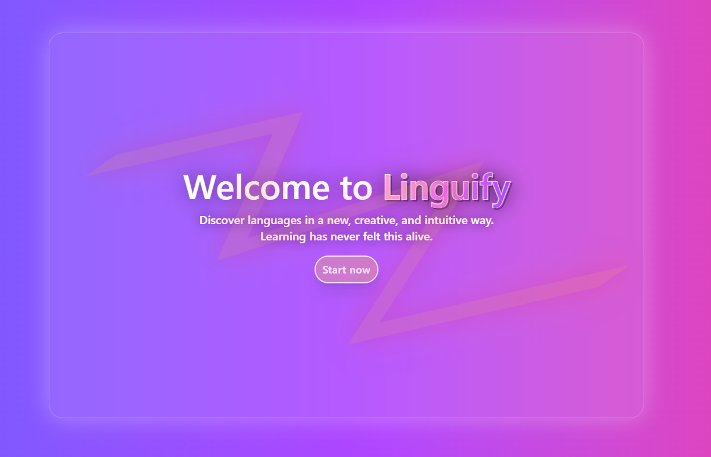
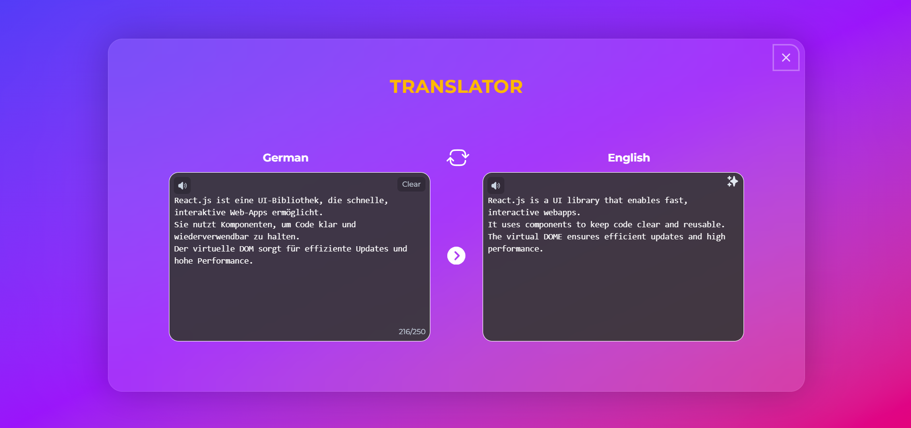
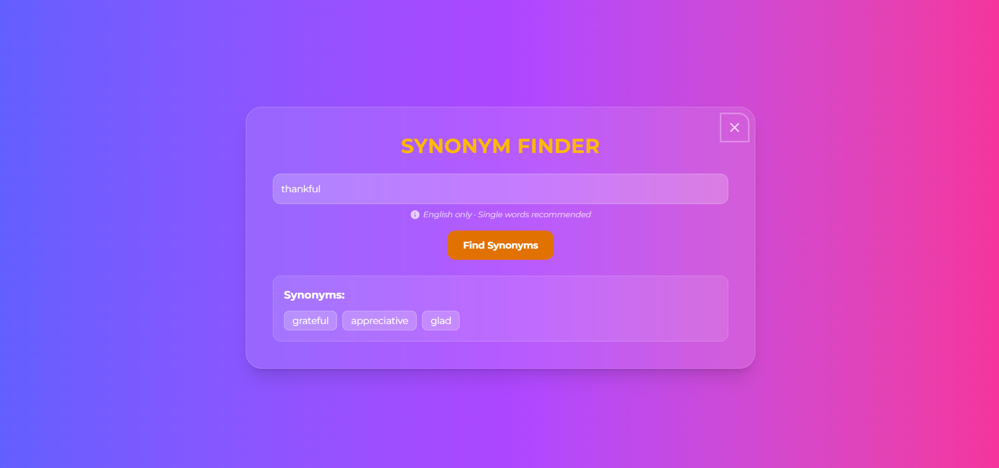
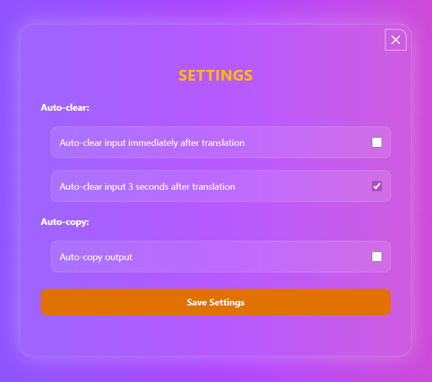
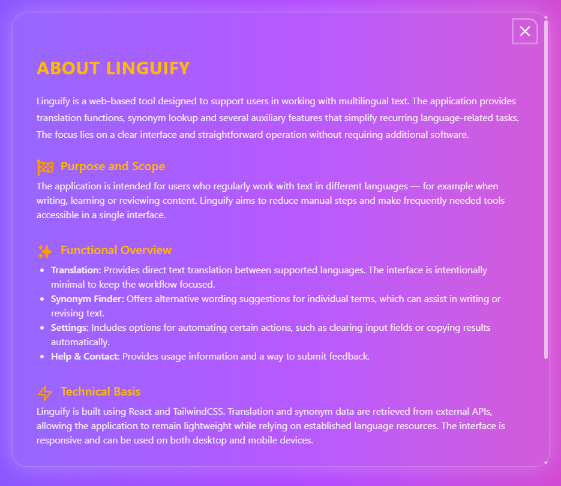
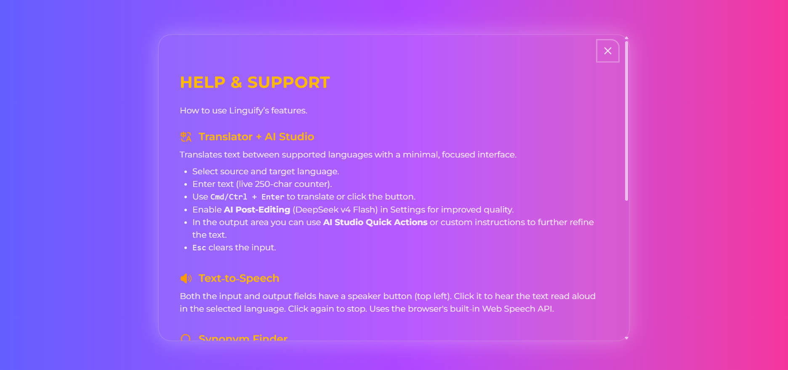
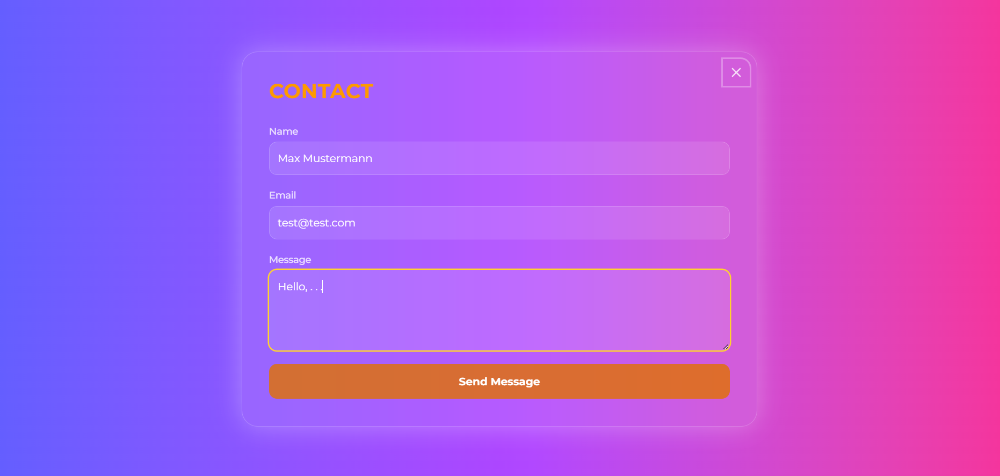

# Linguify

[](https://react.dev)
[](https://tailwindcss.com)
[](https://vitejs.dev)
[](https://jestjs.io)
[](#)

Linguify is a client‑side web application designed to support users in working with multilingual text.
It provides translation, synonym lookup and configurable automation features.
The application is built with React, TailwindCSS and Vite, and communicates with external APIs for language data.

## Screenshots

### Start Page



### Translator Module



### Synonym Finder



### Settings



### About App



### Help



### Contact



## Table of Contents

- [Features](#features)
- [Technical Overview](#technical-overview)
- [Architecture](#architecture)
- [Project Structure](#project-structure)
- [APIs](#apis)
- [Testing](#testing)
- [Installation](#installation)
- [Development](#development)
- [Build](#build)
- [Deployment](#deployment)
  - [GitHub Pages](#github-pages-deployment)
  - [Vercel](#vercel-deployment)

## Features

### Translation

- Direct translation between supported languages
- Minimalistic interface
- Language switching
- Optional automatic clearing or copying of results
- Suitable for short and medium text segments
- Keyboard shortcuts: Cmd/Ctrl + Enter to translate, Esc to clear input

### Synonym Finder

- Provides alternative wording suggestions
- Useful for text revision and vocabulary expansion
- Filters out unsuitable entries such as long phrases or non‑word tokens

### Settings

- Auto‑clear (immediate or delayed)
- Auto‑copy
- Settings stored locally via `localStorage`
- Changes are persisted automatically (no save button required)

### Help & Contact

- Usage explanations
- Contact form for feedback or issue reporting

### Routing

- Client-side routing via React Router
- Dedicated 404 page for unmatched routes

## Technical Overview

- **Framework:** React
- **Build Tool:** Vite
- **Styling:** TailwindCSS
- **Routing:** React Router
- **State Management:** React Hooks + Custom Hooks + Context API
- **Persistence:** Browser `localStorage`
- **APIs:** External REST APIs (no backend required)
- **Testing:** Jest + React Testing Library
- **Deployment:** Hosted on GitHub Pages and Vercel

## Architecture

Linguify follows a modular, component‑based architecture:

- **UI Components:** Reusable elements (buttons, selectors, inputs)
- **Layouts:** Page wrappers for consistent structure
- **Pages:** High‑level views (Entry/Home, Menu, Translator, Synonym Finder, Help, About, Settings, Contact, Not Found)
- **Custom Hooks:**
  - `useTranslator()` – translation logic, API communication, input validation
  - `useLanguageSwitcher()` – language selection and switching
  - `useSettings()` – re-export of the SettingsContext hook
- **Context:**
  - `SettingsContext` – global settings state, reactive across all components without prop drilling; changes are auto‑persisted to localStorage via useEffect
- **External APIs:** Called directly from hooks
- **No backend:** All logic runs client‑side

## Project Structure

```text
Linguify/
│
├── docs/                      # Documentation files, images, screenshots for README
│   └── screenshots/           # All project screenshots used in documentation
│
├── public/                    # Static public assets served as-is (favicon, manifest, etc.)
│
├── src/                       # Main application source code
│   ├── __tests__/             # Component tests (Jest + React Testing Library)
│   ├── assets/                # Optional static assets (icons, images)
│   ├── components/            # Reusable UI components
│   ├── context/               # React Context for global state (SettingsContext)
│   ├── data/                  # Static data (e.g., language list)
│   ├── hooks/                 # Custom React hooks containing application logic
│   ├── layout/                # Layout wrappers for consistent page structure
│   ├── pages/                 # Main application pages (Translator, Help, About, Settings, ...)
│   ├── App.jsx                # Application routing configuration
│   ├── index.css              # Global stylesheet
│   └── main.jsx               # Application entry point (Vite + React initialization)
│
├── .gitignore                 # Git ignore rules
├── babel.config.cjs           # Babel configuration for Jest
├── jest.config.cjs            # Jest configuration
├── setupTests.js              # Jest setup file (Testing Library matchers)
├── index.html                 # Root HTML template used by Vite
├── package.json               # Project metadata, dependencies and scripts
├── package-lock.json          # Dependency lockfile for reproducible installs
├── postcss.config.js          # PostCSS configuration (used by TailwindCSS)
├── tailwind.config.js         # TailwindCSS configuration file
├── vite.config.js             # Vite build and development configuration
└── README.md                  # Project documentation
```

## APIs

### 1. MyMemory Translation API

https://api.mymemory.translated.net/

- Free, no authentication
- Rate limits apply (500 characters per request on the free tier)
- Quality varies depending on language pair

### 2. Datamuse API (Synonyms)

https://api.datamuse.com/

- Provides synonyms and related words
- Results filtered client‑side

## Testing

Linguify includes component tests written with [Jest](https://jestjs.io) and [React Testing Library](https://testing-library.com/docs/react-testing-library/intro/).

### Run tests

```bash
npm test
```

### Test files

| File                                     | What is tested                                                                                                          |
| ---------------------------------------- | ----------------------------------------------------------------------------------------------------------------------- |
| `src/__tests__/ErrorBox.test.jsx`        | Renders nothing on null/empty error, displays message when error is provided, updates correctly when error prop changes |
| `src/__tests__/TranslateButton.test.jsx` | Enabled/disabled state, loading indicator, click handler called correctly, disabled button ignores clicks               |

### Testing approach

Tests focus on **user-visible behaviour** rather than implementation details:

- `render()` mounts components into a virtual DOM (jsdom)
- `screen` queries elements the same way a user would see them
- `fireEvent` simulates real interactions such as clicks
- `queryByText` is used to assert absence of elements without throwing

## Installation and Development

```bash
git clone <repository-url>
cd linguify
npm install
npm run dev
```

```text
Default URL:
http://localhost:5173
```

## Build

```bash
npm run build
```

Output directory: dist/

## Deployment

### GitHub Pages Deployment

Update vite.config.js:

```js
export default defineConfig({
  base: "/<repository-name>/",
});
```

Build the project:

```bash
npm run build
```

Deploy the dist/ folder using GitHub Pages or a GitHub Action.

### Vercel Deployment

Import the repository at: https://vercel.com/import

Configure the project:

- Framework: Vite
- Build Command: npm run build
- Output Directory: dist
- Deploy the project
