# Linguify

## 🔗 **Live:** [linguify-web.vercel.app](https://linguify-web.vercel.app)

[](https://react.dev)
[](https://tailwindcss.com)
[](https://www.framer.com/motion/)
[](https://vitejs.dev)
[](https://www.deepseek.com)
[](https://supabase.com)
[](https://resend.com)
[](https://reactrouter.com)
[](https://jestjs.io)
[](https://vercel.com)
[](#)
[](#)

**Linguify** is a fullstack web application for multilingual text work. It combines fast translation with powerful DeepSeek AI post-editing, an interactive AI Studio, text-to-speech, synonym lookup, user accounts with a persisted translation history (Supabase), and a secure contact form.

## 🔗 **Live:** [linguify-web.vercel.app](https://linguify-web.vercel.app)

## Screenshots

### Start Page


### Menu Page

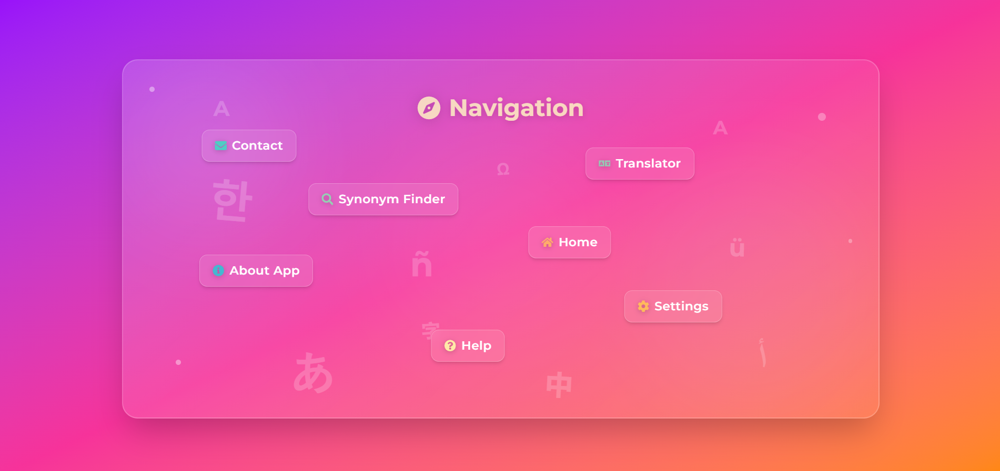

### About App

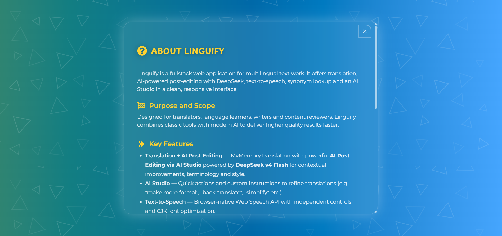

### Help

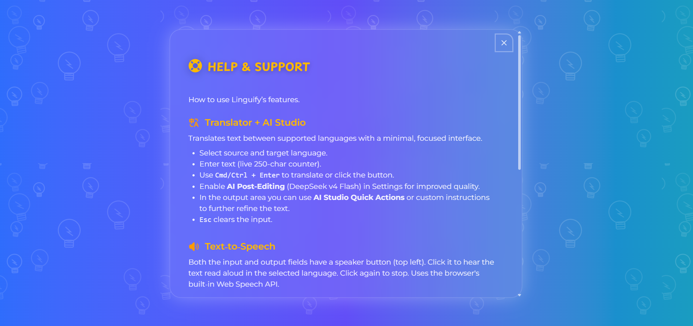

### Contact

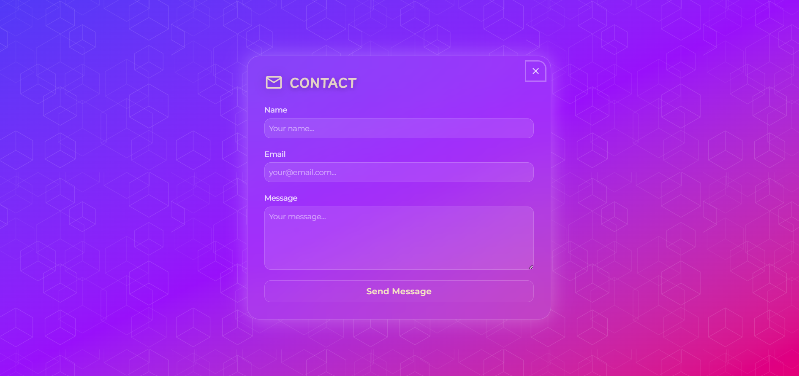

### Sign Up

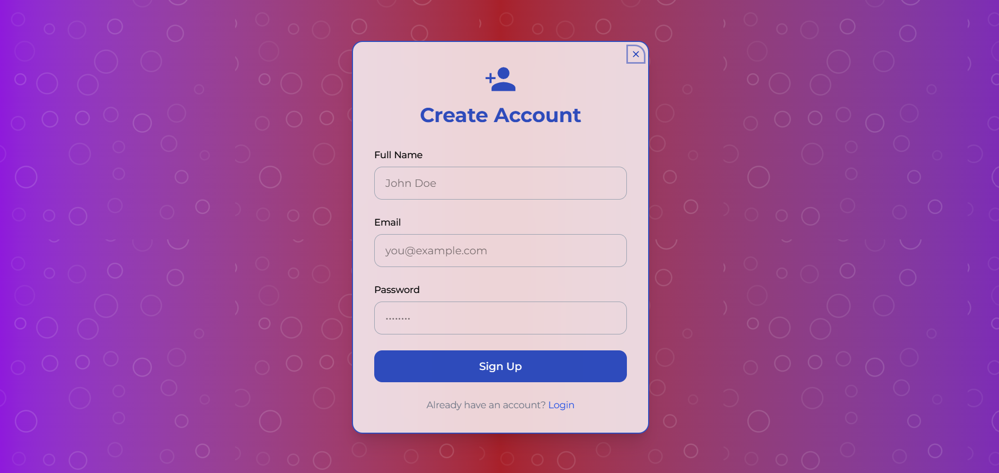

### Login

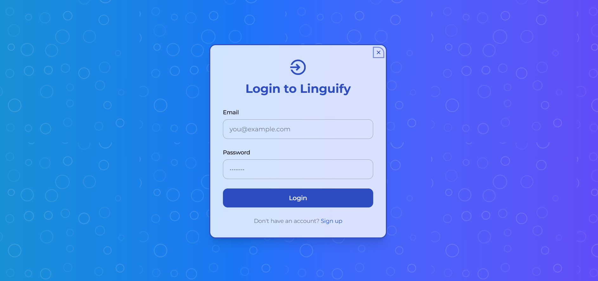

### Translator Module

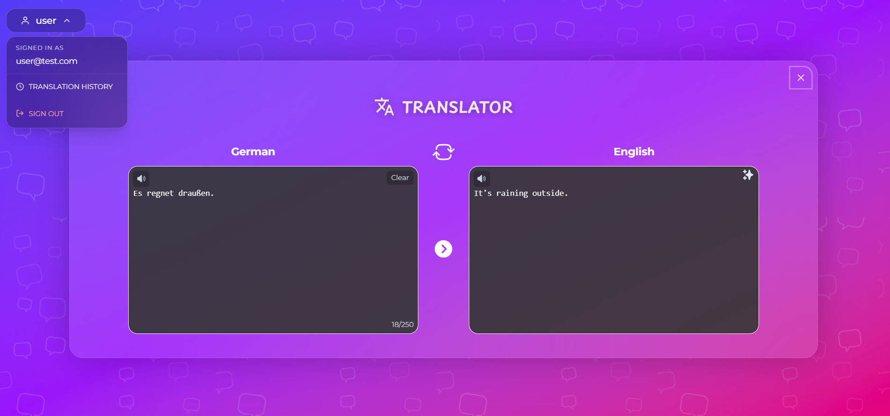

### Translation History

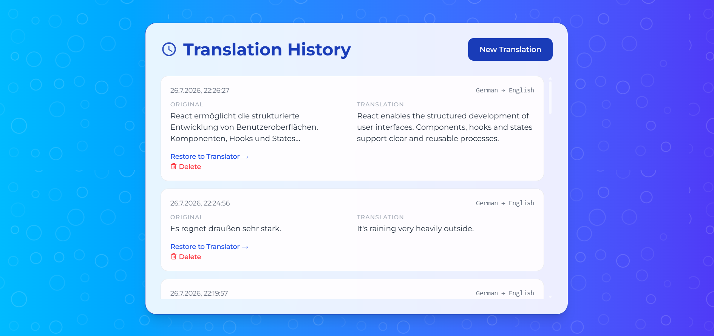

### AI Studio

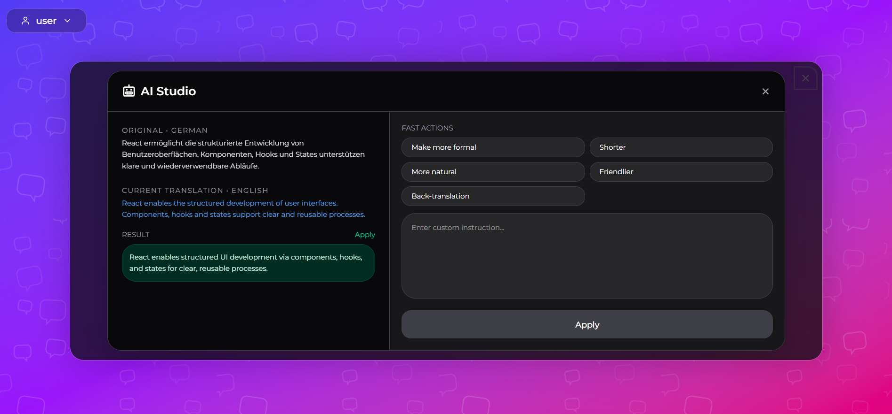

### Synonym Finder

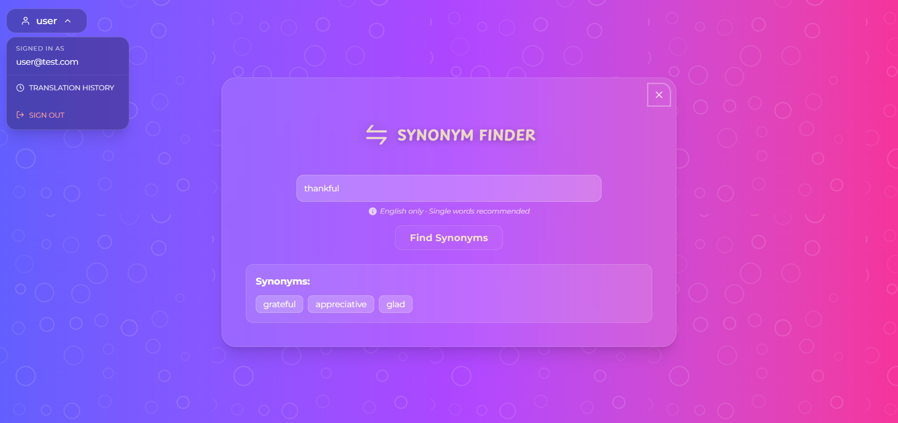

### Settings

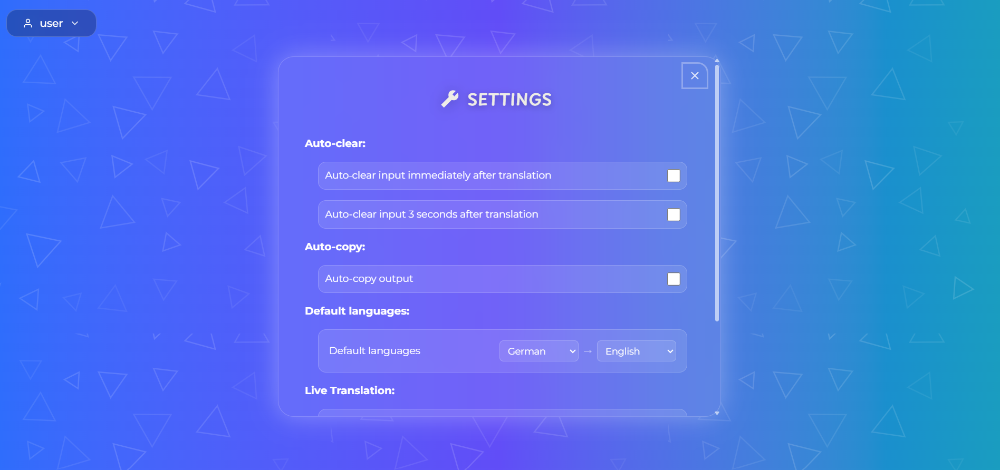

### 404 Not Found Page


---

## Table of Contents

- [Features](#features)
- [Technical Overview](#technical-overview)
- [Architecture](#architecture)
- [Project Structure](#project-structure)
- [APIs & Services](#apis--services)
- [Testing](#testing)
- [Local Development](#local-development)
- [Deployment](#deployment)
- [Environment Variables](#environment-variables)

---

## Features

### Translation

- Direct translation between 20+ languages via **MyMemory API**
- **AI Post-Editing** powered by **DeepSeek v4 Flash** for significantly higher quality, contextual corrections and better terminology
- **Live translation** — translates automatically while typing after a short pause (debounced, opt-in via Settings)
- **Live character counter** with 250-character limit
- **Keyboard shortcuts**: `Cmd/Ctrl + Enter` to translate, `Esc` to clear
- Optional **auto-clear** (immediate or delayed) & **auto-copy**

### AI Studio & AI Post-Editing

- **AI Studio button** directly in the translation output textarea
- Opens a modal with Quick Actions (e.g. "make more formal", "simplify", "back-translate")
- Custom free-text instructions / prompts
- Instant refinement of the current translation using **DeepSeek v4 Flash** (fast & cost-effective)
- Rate-limited to protect API quota

### Text-to-Speech

- Reads input and output text aloud in the selected language
- Uses the browser's built-in **Web Speech API**
- Independent playback controls per field (stop/start)
- Automatically uses **CJK-optimized** font (Noto Sans JP) for Asian languages

### User Accounts & Translation History

- **Login / Sign-up** via **Supabase Auth** (email + password)
- Protected `/history` route — redirects to `/login` if not authenticated, without a flash of the login page for already-logged-in users
- Every manual translation (and applied AI Studio refinement) is saved to a **Supabase Postgres** table (`translation_history`)
- History page lists past translations with source/target language and timestamp, with a **"Restore to Translator"** action per entry
- **Delete** — remove a single entry via a confirmation modal (prevents accidental data loss)
- **Search bar** — find past translations by their source or target text (debounced)
- **Filters** — narrow the list by source language, target language, and/or date range; collapsed behind a toggle on mobile to save space
- **Pagination** — longer histories are split into pages (5 entries per page) with Previous/Next controls, always resetting to page 1 when a filter changes
- **Row Level Security (RLS)** enforced in Postgres — each user can only ever read, insert, or delete their own history rows, verified at the database level (see `supabase/migrations/`)

### Synonym Finder

- Alternative wording suggestions via **Datamuse API** (English-focussed)
- Animated result chips with staggered entrance

### Settings

- **Auto-clear** input (immediate or delay)
- **Auto-copy** translation output to clipboard
- **Live translation** toggle — enables automatic translation while typing
- All changes **auto-persisted** to `localStorage` via `useEffect` — no save button

### Contact Form

- Connected to **Resend** email API via a Vercel Serverless Function
- Input **sanitization** (HTML injection prevention)
- Server-side **email format validation**
- **Rate limiting** via **Upstash Redis**
- Separate Express.js server for local development with `express-rate-limit`

### Navigation & UX

- Animated menu with staggered button fly-in (**Framer Motion**)
- Entrance animations on every page (consistent scale + opacity pattern)
- Floating multilingual background characters on the start page
- Client-side routing with **React Router** + dedicated **404 page**
- Smooth translate button spinner (cross-fade, no hard jump)
- Layout-shift-free error and copy notifications (opacity overlay pattern)

---

## Technical Overview

| Area               | Technology                                                                        |
| ------------------ | --------------------------------------------------------------------------------- |
| **Frontend**       | React 19, TailwindCSS 4, Framer Motion                                            |
| **Build Tool**     | Vite 7                                                                            |
| **Routing**        | React Router                                                                      |
| **State**          | React Hooks, Custom Hooks, Context API                                            |
| **Animations**     | Framer Motion (page transitions, stagger, AnimatePresence) + custom CSS keyframes |
| **Auth**           | Supabase Auth (email/password), `AuthContext` + `ProtectedRoute`                  |
| **Database**       | Supabase Postgres (`translation_history`, secured via Row Level Security)         |
| **Backend (prod)** | Vercel Serverless Functions (`api/contact.js`, `api/improve.js`)                  |
| **Backend (dev)**  | Express.js (`backend/server.js`)                                                  |
| **AI**             | **DeepSeek v4 Flash** – AI Studio Post-Editing                                    |
| **Email**          | Resend API                                                                        |
| **Rate Limiting**  | Upstash Redis + `@upstash/ratelimit` (prod) / `express-rate-limit` (dev)          |
| **Persistence**    | Browser `localStorage` (settings) + Supabase Postgres (translation history)       |
| **Testing**        | Jest 30 + React Testing Library                                                   |
| **Deployment**     | Vercel                                                                            |

## Architecture

```
Browser (React SPA)
    │
    ├── Translation  ──────────────► MyMemory API (external)
    ├── Synonym Finder ────────────► Datamuse API (external)
    ├── Text-to-Speech ────────────► Web Speech API (browser built-in)
    ├── AI Studio Post-Editing ────► DeepSeek v4 Flash (via /api/improve)
    │
    ├── Auth (Login / Sign-up) ────► Supabase Auth
    │                                       │
    ├── Translation History ───────► Supabase Postgres (translation_history)
    │                                       │
    │                                 Row Level Security
    │                                 (auth.uid() = user_id)
    │
    └── Contact Form
            │
            ├── Production ────────► Vercel Serverless Function
            │                              │
            │                        Upstash Redis (rate limit)
            │                              │
            │                          Resend API ──► Email
            │
            └── Local Dev ─────────► Express.js server (localhost:3000)
                                           │
                                     express-rate-limit
                                           │
                                       Resend API ──► Email
```

### Architecture Highlights

- AI Studio is triggered manually from the output textarea button
- All AI refinement happens on-demand via user interaction
- **Cost-conscious by design**: the free MyMemory API handles all default/live translation; the paid DeepSeek API is only reached when the user explicitly opens AI Studio, so per-request AI costs stay proportional to actual demand for higher-quality output, not every translation
- Live translation uses a debounced hook (`useDebounce`) to minimize API calls while typing
- Routes are lazy-loaded (`React.lazy` + `Suspense`) except the entry page, so users only download the code for pages they actually visit
- An app-wide `ErrorBoundary` catches render crashes and shows a fallback instead of a blank screen
- `/history` is wrapped in `ProtectedRoute`, which reads auth state from `AuthContext` (session check + `onAuthStateChange` subscription) and redirects unauthenticated users to `/login`
- History reads/writes go directly from the client to Supabase (no custom backend endpoint); authorization is enforced entirely via Postgres Row Level Security, not application code

### Frontend Structure

- **Pages** — each with a Framer Motion entrance animation
- **Layouts** — page wrappers for consistent card/container structure
- **Components** — reusable UI elements (buttons, selectors, text areas, tooltips, `ErrorBoundary`)
- **Custom Hooks** — application logic separated from UI:
  - `useTranslator()` — translation, API calls, three-layer error handling, live translation trigger, saves successful translations to history
  - `useDebounce()` — delays a value update until typing pauses; used by `useTranslator` for live translation
  - `useLanguageSwitcher()` — language selection and swap
  - `useSpeech()` — Web Speech API wrapper
  - `useSettings()` — SettingsContext consumer
  - `useImproveTranslation()` — calls the AI Studio improve endpoint, exposes `isImproving` loading state
- **Context** — `SettingsContext` provides global settings state without prop drilling; auto-persisted via `useEffect`. `AuthContext` provides the current Supabase session/user, loading state, and `signOut()`, consumed via `useAuth()`
- **Utils** — `supabaseClient.js` (Supabase client init), `historyService.js` (`saveTranslationToHistory`, `fetchHistory`, `deleteHistoryEntry`)

---

## Project Structure

```
linguify/
│
├── .github/
│   └── workflows/
│       └── test.yml            # CI: lint, dependency audit, tests
│
├── api/
│   ├── contact.js              # Vercel Serverless Function (prod backend)
│   └── improve.js              # DeepSeek Post-Editing
│
├── backend/
│   ├── server.js               # Express.js dev server
│   └── package.json
│
├── docs/
│   └── screenshots/            # README screenshots
│
├── shared/                     # Logic shared between Vercel functions & Express dev server
│   ├── contactService.js
│   ├── contactSanitize.js
│   ├── deepseekService.js
│   └── missingEnvVar.js        # fail-fast check for required env vars
│
├── supabase/
│   └── migrations/             # SQL migrations: translation_history table + RLS policies
│
├── src/
│   ├── __tests__/              # Jest + React Testing Library tests
│   ├── components/             # Reusable UI components (incl. ErrorBoundary.jsx, AIStudioModal.jsx, ProtectedRoute.jsx)
│   ├── context/                # SettingsContext + AuthContext (global state)
│   ├── data/                   # Static data (language list + helper)
│   ├── hooks/                  # Custom React hooks (incl. useDebounce.js, useImproveTranslation.js)
│   ├── layout/                 # Page layout wrappers
│   ├── pages/                  # Application pages (incl. LoginPage, SignUpPage, HistoryPage)
│   ├── utils/                  # supabaseClient.js, historyService.js, apiUrl.js, etc.
│   ├── App.jsx                 # Routing
│   ├── index.css               # Global styles + CSS animations
│   └── main.jsx                # Entry point, wraps the app in ErrorBoundary
│
├── vercel.json                 # Vercel routing config (SPA + API rewrites)
├── vite.config.js
├── tailwind.config.js
├── jest.config.cjs
└── package.json
```

---

## APIs & Services

### MyMemory Translation API -> For Translating

`https://api.mymemory.translated.net/`

### Datamuse API -> For Synonym Finding

`https://api.datamuse.com/`

### Resend API -> For Email Sending

`https://resend.com`

### Upstash Redis -> For persistent Rate Limiting

`https://upstash.com`

### Supabase -> Auth & Translation History storage (Postgres + Row Level Security)

`https://supabase.com`

### DeepSeek v4 Flash –> AI Post-Editing

---

## Testing

Tests are written with [Jest](https://jestjs.io) and [React Testing Library](https://testing-library.com).

### Run tests

```bash
npm test
```

### Test files

| File                                 | What is tested                                                                                                |
| ------------------------------------ | ------------------------------------------------------------------------------------------------------------- |
| `__tests__/ErrorBox.test.jsx`        | Invisible (opacity-0) on null/empty, visible (opacity-100) with message, updates on prop change               |
| `__tests__/TranslateButton.test.jsx` | Arrow visible in idle state, spinner visible while translating, click handler, disabled button ignores clicks |
| `__tests__/useDebounce.test.js`      | Value only updates after the debounce delay elapses, resets on rapid subsequent changes                       |
| `__tests__/useTranslator.test.js`    | Empty-input validation (no API call), successful translation flow stores the result and clears the error      |
| `__tests__/AIStudio.test.jsx`        | Quick action buttons and custom instruction input send the correct parameters to the AI improvement API       |

### Testing approach

Tests focus on **user-visible behaviour**:

- `render()` mounts components into a virtual DOM (jsdom)
- `screen` queries elements the same way a user would see them
- `fireEvent` simulates real interactions such as clicks
- `queryByText` is used to assert absence of elements without throwing

---

## Continuous Integration

Every push and pull request against `main` runs automatically via GitHub Actions (`.github/workflows/test.yml`):

1. **Lint** — `npm run lint` (ESLint 9, flat config)
2. **Dependency audit** — `npm audit --audit-level=high`, for both the root project and `backend/`
3. **Tests** — `npm test`

All three must pass before a PR can be merged.

---

## Local Development

### Frontend

```bash
git clone <repository-url>
cd linguify
npm install
npm run dev
# → http://localhost:5173
```

### Backend (for Contact Form)

```bash
cd backend
npm install
# Create a .env file
npm run dev
# → http://localhost:3000
```

---

## Deployment

The app is deployed on **Vercel**.

```bash
# Install Vercel CLI
npm i -g vercel

# Deploy
vercel
```

---

## Environment Variables

### Frontend (`.env`)

```env
VITE_API_URL=http://localhost:3000
VITE_SUPABASE_URL=your_supabase_project_url
VITE_SUPABASE_KEY=your_supabase_anon_key
```

### Backend (`backend/.env`)

```env
RESEND_API_KEY=your_resend_api_key
SENDER_EMAIL=your_verified_sender@yourdomain.com
RECIPIENT_EMAIL=your_email@example.com
DEEPSEEK_API_KEY=your_deepseek_api_key
```

### Vercel (Dashboard → Project -> Settings → Environment Variables)

```env
RESEND_API_KEY=your_resend_api_key
SENDER_EMAIL=your_verified_sender@yourdomain.com
RECIPIENT_EMAIL=your_email@example.com
UPSTASH_REDIS_REST_URL=your_upstash_redis_url
UPSTASH_REDIS_REST_TOKEN=your_upstash_redis_token
DEEPSEEK_API_KEY=your_deepseek_api_key
```

> **List `.env` file in `.gitignore`.**
>
> Missing required environment variables are caught at request time with a clear `500` error (`Server is not configured.`) instead of a cryptic crash — see `shared/missingEnvVar.js`.

---

## Planned features

- Further AI Studio enhancements
- More languages
